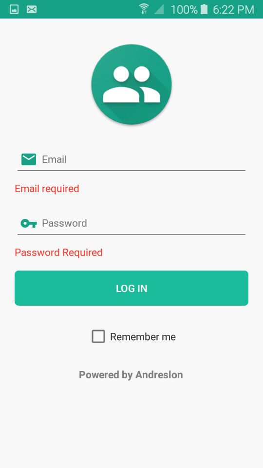

# Prospects-Xamarin
Aplicación con un inicio de sesión, información del usuario y una lista de prospectos (posibles nuevos clientes) que podrán ser editados localmente, y deberá tener almacenamiento local de datos y consumo de servicios REST.

# Apk
[Click para descargar](https://github.com/andreslon/Prospects-Xamarin/apks/com.prospects.apk)

  

  

  

  

  

  

  

  

  

  

  

    
  
   
    
   
    
   
  
     